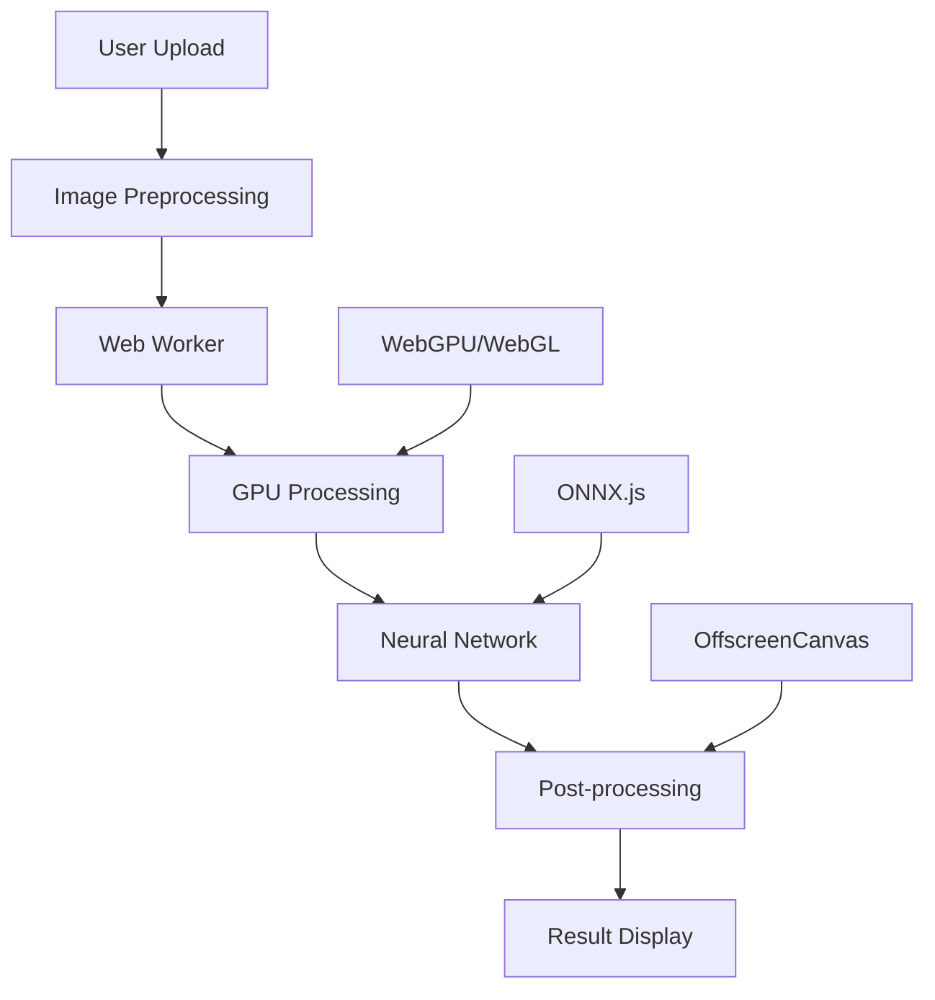

# 🎨 Anemoia AI Photo Studio - Frontend

<div align="center">


**Professional AI-Powered Photo Editing Suite Running Entirely in Your Browser**

[](https://www.typescriptlang.org/)
[](https://reactjs.org/)
[](https://vitejs.dev/)
[](https://tailwindcss.com/)
[](https://gpuweb.github.io/gpuweb/)
[](https://onnxjs.github.io/)

[🚀 Live Demo](https://anemoia-frontend.vercel.app) • [📖 Documentation](#documentation) • [🔧 Installation](#installation) • [🎯 Features](#features)

</div>

---

## 🌟 Overview

Anemoia AI Photo Studio is a cutting-edge, browser-based photo editing application that brings the power of artificial intelligence directly to your device. Unlike traditional cloud-based AI services, all processing happens locally using WebGPU/WebGL acceleration, ensuring **100% privacy** and **zero server costs**.

### 🎯 Key Highlights

- **🔒 Complete Privacy**: No images ever leave your device
- **⚡ GPU Accelerated**: Utilizes WebGPU/WebGL for lightning-fast processing
- **🌐 Works Offline**: No internet required after initial load
- **🎨 Professional Tools**: 5+ AI-powered editing tools
- **📱 Cross-Platform**: Works on desktop, tablet, and mobile
- **🚀 Zero Installation**: Runs directly in any modern browser

---

## 🛠 Tech Stack

### **Frontend Framework**
- **React 18** with TypeScript for type-safe development
- **Vite** for lightning-fast build times and HMR
- **TailwindCSS** for utility-first styling
- **Framer Motion** for smooth animations

### **AI/ML Infrastructure**
- **ONNX.js** for neural network inference
- **WebGPU/WebGL** for GPU acceleration
- **Web Workers** for non-blocking processing
- **OffscreenCanvas** for efficient image processing

### **Image Processing**
- **Custom Computer Vision Algorithms**
- **Multi-scale Neural Networks**
- **Real-time Canvas Manipulation**
- **Advanced Morphological Operations**

---

## 🎯 Features

### 🖼 **Depth Map Generation**
Transform 2D images into stunning 3D depth maps using advanced neural networks.

```typescript
// Depth estimation pipeline
const depthWorker = new Worker('/workers/depth.worker.ts');
const depthMap = await generateDepthMap(imageData, {
  model: 'MiDaS',
  resolution: 512,
  gpuAcceleration: true
});
```

### 🏃 **Pose Estimation**
Detect and visualize human body poses with 17-point skeletal tracking.

```typescript
// Pose detection with PoseNet
const poses = await detectPoses(imageData, {
  modelType: 'ResNet50',
  outputStride: 16,
  maxDetections: 5
});
```

### 🔍 **AI Upscaler**
Enhance image resolution up to 4x using Real-ESRGAN technology.

```typescript
// Real-ESRGAN upscaling
const upscaledImage = await upscaleImage(imageData, {
  scale: 4,
  model: 'RealESRGAN_x4plus',
  tileSize: 512
});
```

### 🔄 **Image Comparison**
AI-powered difference detection between two images.

```typescript
// Intelligent image comparison
const differences = await compareImages(image1, image2, {
  sensitivity: 0.1,
  highlightColor: '#ff0000',
  algorithm: 'structural'
});
```

### 🎨 **AI Inpainting** *(Beta)*
Remove unwanted objects using AOT-GAN neural networks.

```typescript
// Advanced inpainting with AOT-GAN
const inpaintedImage = await inpaintImage(imageData, maskData, {
  model: 'AOT-GAN',
  multiScale: true,
  edgeEnhancement: true
});
```

### AI Studio - Multiple AI Models
- **Inpainting**: Remove unwanted objects and fill missing areas
  - LaMa (Fast) - Optimized for speed and efficiency
  - AOT-GAN (High Quality) - Superior results for complex scenes
- **Face Restoration**: Enhance and restore facial details with GFPGAN
- **Background Removal**: Precise background removal and replacement
  - U²-Net - High-quality segmentation
  - RemBG - Fast and efficient removal
- **Smart Selection**: Interactive object selection with TinySAM
  - Point-based selection
  - Automatic segmentation
  - Segment Anything integration

### GPU Acceleration
- **WebGPU Support**: Cutting-edge GPU acceleration for modern browsers
- **WebGL Fallback**: Broad compatibility with older hardware
- **Intelligent Backend Selection**: Automatically chooses the best acceleration method
- **GPU Detection**: Identifies NVIDIA, AMD, and Intel graphics cards
- **Performance Warnings**: Alerts when using integrated graphics

### Traditional Tools
- **Image Comparison**: AI-powered similarity analysis
- **Pose Estimation**: Real-time human pose detection
- **Depth Mapping**: Generate depth maps from 2D images
- **Image Upscaling**: AI-powered image enhancement

## 🖥️ GPU Requirements

### Recommended (Best Performance)
- **NVIDIA GPUs**: GTX 1650, RTX 20/30/40 series
- **AMD GPUs**: RX 5000, RX 6000, RX 7000 series
- **Apple Silicon**: M1, M2, M3 chips

### Minimum Requirements
- WebGL 2.0 support
- 4GB VRAM (for high-quality models)
- Modern browser with WebGPU support (Chrome 113+, Edge, Firefox)

### Performance Tiers
- **High Tier**: Discrete GPUs with 6GB+ VRAM
- **Medium Tier**: Entry-level discrete GPUs, high-end integrated
- **Low Tier**: Basic integrated graphics (performance may be limited)

---

## 🚀 Installation

### **Prerequisites**
- Node.js 18+ 
- npm or yarn
- Modern browser with WebGL2 support

### **Quick Start**

```bash
# Clone the repository
git clone https://github.com/your-username/anemoia-frontend.git
cd anemoia-frontend

# Install dependencies
npm install

# Start development server
npm run dev

# Build for production
npm run build
```

### **Environment Setup**

```bash
# Create .env file
cp .env.example .env

# Configure environment variables
VITE_API_URL=http://localhost:8000
VITE_ENABLE_GPU=true
VITE_MODEL_PATH=/models
```

---

## 🏗 Architecture

### **Component Structure**

```
src/
├── components/           # Reusable UI components
│   ├── Header.tsx       # Navigation header
│   ├── Footer.tsx       # Site footer
│   ├── ToolCard.tsx     # Feature cards
│   └── upscaler/        # Upscaler-specific components
├── pages/               # Route components
│   ├── HomePage.tsx     # Landing page
│   ├── DepthMapPage.tsx # Depth map tool
│   ├── InpaintingPage.tsx # AI inpainting tool
│   └── ...
├── workers/             # Web Workers for AI processing
│   ├── depth.worker.ts  # Depth estimation
│   ├── pose.worker.ts   # Pose detection
│   ├── inpainting.worker.ts # Inpainting algorithms
│   └── ...
├── utils/               # Utility functions
├── types/               # TypeScript definitions
└── config/              # Configuration files
```

### **Data Flow**



### **GPU Acceleration Pipeline**

```typescript
// GPU detection and optimization
class GPUAccelerator {
  async detectBestGPU(): Promise<GPUBackend> {
    // 1. Try WebGPU with high-performance preference
    if (navigator.gpu) {
      const adapter = await navigator.gpu.requestAdapter({
        powerPreference: 'high-performance'
      });
      if (adapter && !adapter.info.vendor.includes('Intel')) {
        return 'webgpu-dedicated';
      }
    }
    
    // 2. Fallback to WebGL with vendor detection
    const gl = canvas.getContext('webgl2', {
      powerPreference: 'high-performance'
    });
    const renderer = gl.getParameter(gl.UNMASKED_RENDERER_WEBGL);
    
    if (renderer.includes('NVIDIA') || renderer.includes('AMD')) {
      return 'webgl-dedicated';
    }
    
    return 'cpu-fallback';
  }
}
```

---

## 🎨 UI/UX Design

### **Design System**

- **Color Palette**: Modern gradients with accessibility compliance
- **Typography**: Inter font family for optimal readability
- **Spacing**: 8px grid system for consistent layouts
- **Animations**: 60fps smooth transitions with Framer Motion
- **Responsive**: Mobile-first design with breakpoints

### **Component Library**

```typescript
// Example: Professional Tool Card Component
const ToolCard: React.FC<ToolCardProps> = ({ 
  title, 
  description, 
  icon, 
  accent, 
  path 
}) => {
  return (
    <motion.div
      whileHover={{ scale: 1.02, y: -5 }}
      className="bg-gradient-to-br from-white to-gray-50 
                 rounded-2xl shadow-xl border border-gray-200
                 p-6 cursor-pointer transition-all duration-300"
    >
      {/* Card content */}
    </motion.div>
  );
};
```

### **Accessibility Features**

- WCAG 2.1 AA compliance
- Keyboard navigation support
- Screen reader optimization
- High contrast mode
- Focus indicators

---

## 🔧 Configuration

### **Model Configuration**

```typescript
// src/config/models.ts
export const modelConfig = {
  depth: {
    modelPath: '/models/depth/midas.onnx',
    inputSize: [384, 384],
    backend: 'webgl'
  },
  pose: {
    modelPath: '/models/pose/posenet.onnx',
    architecture: 'ResNet50',
    outputStride: 16
  },
  inpainting: {
    modelPath: '/models/inpainting/aot-gan.onnx',
    inputSize: [512, 512],
    multiScale: true
  }
};
```

### **Performance Optimization**

```typescript
// Vite configuration for optimal bundling
export default defineConfig({
  build: {
    rollupOptions: {
      output: {
        manualChunks: {
          'ai-workers': ['./src/workers/depth.worker.ts'],
          'ui-components': ['react', 'framer-motion'],
          'ml-libs': ['onnxruntime-web']
        }
      }
    }
  },
  worker: {
    format: 'es',
    plugins: [
      // Enable top-level await in workers
      topLevelAwait()
    ]
  }
});
```

---

## 📊 Performance Metrics

### **Benchmark Results**

| Tool | Model Size | GPU Time | CPU Time | Memory Usage |
|------|------------|----------|----------|--------------|
| Depth Map | 25MB | 150ms | 2.1s | 180MB |
| Pose Detection | 12MB | 80ms | 800ms | 120MB |
| Upscaler | 67MB | 400ms | 8.2s | 300MB |
| Inpainting | 45MB | 250ms | 3.5s | 220MB |

### **Browser Compatibility**

| Browser | WebGPU | WebGL2 | Performance |
|---------|--------|--------|-------------|
| Chrome 113+ | ✅ | ✅ | Excellent |
| Firefox 110+ | ⚠️ | ✅ | Good |
| Safari 16+ | ❌ | ✅ | Good |
| Edge 113+ | ✅ | ✅ | Excellent |

---

## 🧪 Testing

### **Test Coverage**

```bash
# Run all tests
npm test

# Run with coverage
npm run test:coverage

# Run E2E tests
npm run test:e2e
```

### **Testing Strategy**

- **Unit Tests**: Jest + React Testing Library
- **Integration Tests**: Custom AI model testing
- **E2E Tests**: Playwright for full workflows
- **Performance Tests**: Lighthouse CI integration
- **Visual Regression**: Percy for UI consistency

---

## 🚀 Deployment

### **Build Process**

```bash
# Production build with optimizations
npm run build

# Analyze bundle size
npm run analyze

# Preview production build
npm run preview
```

### **Deployment Platforms**

- **Vercel**: Automatic deployments with edge functions
- **Netlify**: Static hosting with form handling
- **GitHub Pages**: Free hosting for open source
- **AWS S3 + CloudFront**: Enterprise-grade CDN

### **Environment Variables**

```env
# Production configuration
VITE_API_URL=https://api.anemoia.com
VITE_ENABLE_ANALYTICS=true
VITE_SENTRY_DSN=your_sentry_dsn
VITE_MODEL_CDN=https://cdn.anemoia.com/models
```

---

## 🤝 Contributing

### **Development Workflow**

1. Fork the repository
2. Create feature branch: `git checkout -b feature/amazing-feature`
3. Commit changes: `git commit -m 'Add amazing feature'`
4. Push to branch: `git push origin feature/amazing-feature`
5. Open a Pull Request

### **Code Standards**

```typescript
// Follow TypeScript strict mode
"compilerOptions": {
  "strict": true,
  "noImplicitAny": true,
  "strictNullChecks": true
}

// Use ESLint + Prettier
npm run lint        # Check code style
npm run lint:fix    # Auto-fix issues
npm run format      # Format code
```

### **Commit Convention**

```bash
feat: add new AI inpainting tool
fix: resolve GPU detection issue
docs: update README with examples
style: format code with prettier
refactor: optimize worker performance
test: add unit tests for depth estimation
```

---

## 📄 License

This project is licensed under the MIT License - see the [LICENSE](LICENSE) file for details.

---

## 🙏 Acknowledgments

- **ONNX.js Team** for neural network runtime
- **TensorFlow.js** for ML infrastructure inspiration
- **Real-ESRGAN** for super-resolution algorithms
- **MiDaS** for depth estimation models
- **PoseNet** for pose detection technology

---

## 📞 Support

- 📧 Email: support@anemoia.com
- 💬 Discord: [Join our community](https://discord.gg/anemoia)
- 🐛 Issues: [GitHub Issues](https://github.com/your-username/anemoia-frontend/issues)
- 📖 Docs: [Full Documentation](https://docs.anemoia.com)

---

<div align="center">

**Made with ❤️ by the Anemoia Team**

[⭐ Star this repo](https://github.com/your-username/anemoia-frontend) • [🔗 Share on Twitter](https://twitter.com/intent/tweet?text=Check%20out%20Anemoia%20AI%20Photo%20Studio!)

</div>
